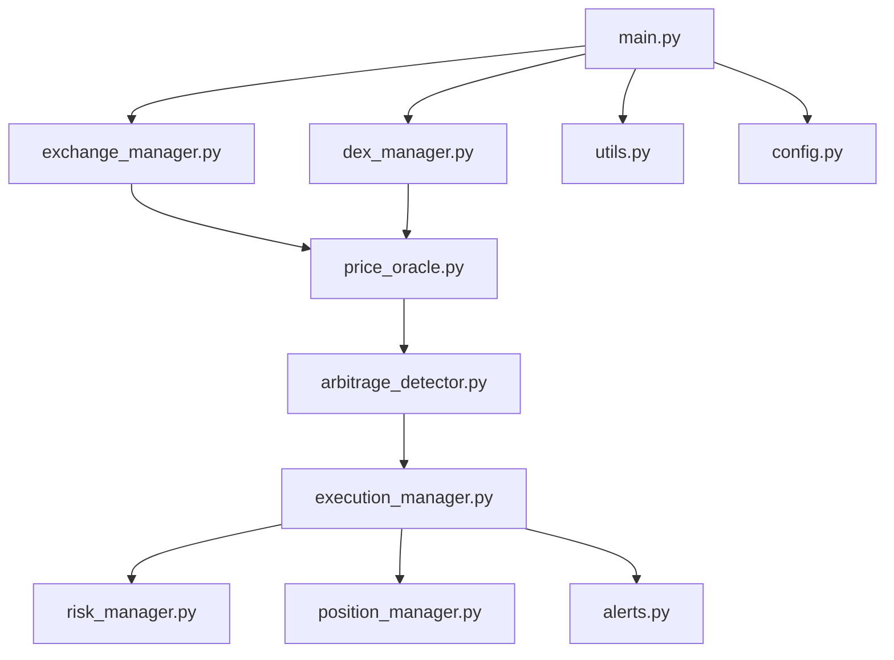

# Aggressive Multi-Venue Pure Arbitrage Bot

## Overview
A high-frequency, token-selective arbitrage bot that aggressively captures price inefficiencies of user-specified tokens across top-tier CEXs and DEXs (Base chain). The bot is modular, risk-managed, and production-ready, supporting both simulated and real trading.

## Features
- User-defined token and stablecoin pairs
- CEX support: Binance, Gate.io, MEXC, Kraken (via CCXT)
- DEX support: Uniswap V3 (Base), Aerodrome (Base, Uniswap V2-style)
- Real-time price aggregation and normalization
- Arbitrage opportunity detection with net profit calculation
- Dual-leg execution (async, concurrent)
- Robust risk management and circuit breakers
- Telegram alerts for trade execution
- Unit test coverage for all core modules
- Test mode for safe simulation

## Architecture


## Setup Instructions
1. **Clone the repo:**
   ```bash
   git clone https://github.com/<your-username>/<your-repo-name>.git
   cd <your-repo-name>
   ```
2. **Install dependencies:**
   ```bash
   pip install -r requirements.txt
   ```
3. **Create your `.env` file:**
   - Copy `.env.example` to `.env` and fill in your API keys, RPC URLs, and settings.
4. **Run the bot in test mode:**
   ```bash
   python main.py --token RIZE
   ```
   (Replace `RIZE` with your target token symbol.)

## Environment Variables
See `.env.example` for all required and optional variables, including:
- CEX/DEX API keys and private key
- RPC URLs for Base/BSC
- Stablecoins, thresholds, slippage, exposure
- Telegram/email alert settings
- Polling interval

## Testing
Run all unit tests with:
```bash
PYTHONPATH=. pytest
```
All core modules are covered by unit tests in the `tests/` directory.

## Security Notes
- **Never commit your `.env` file or private keys to git.**
- Use test wallets and test mode for development.
- API keys should have trading-only permissions (no withdrawals).
- Review and test all logic before running with real funds.

## License
MIT (or your preferred license)
